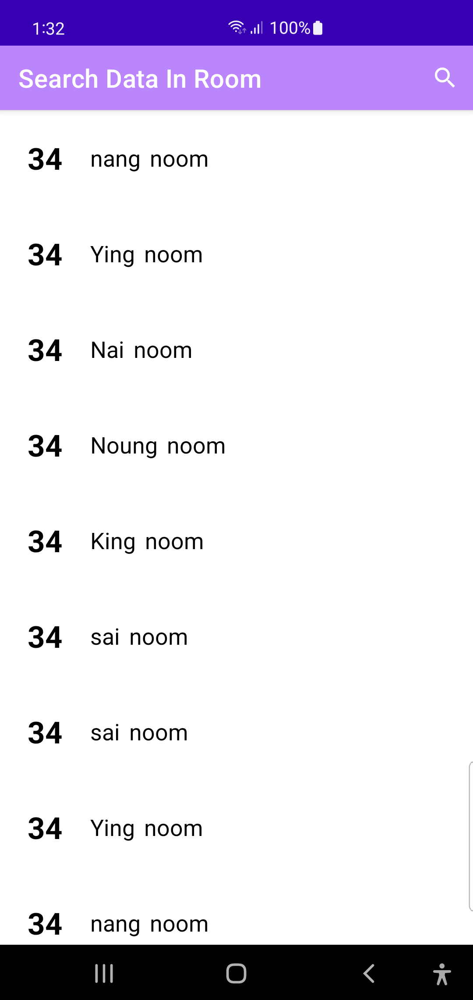
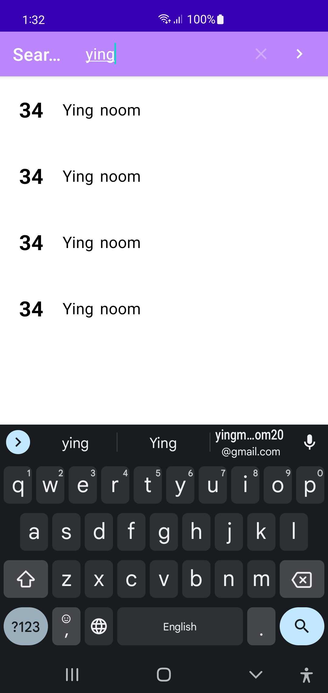
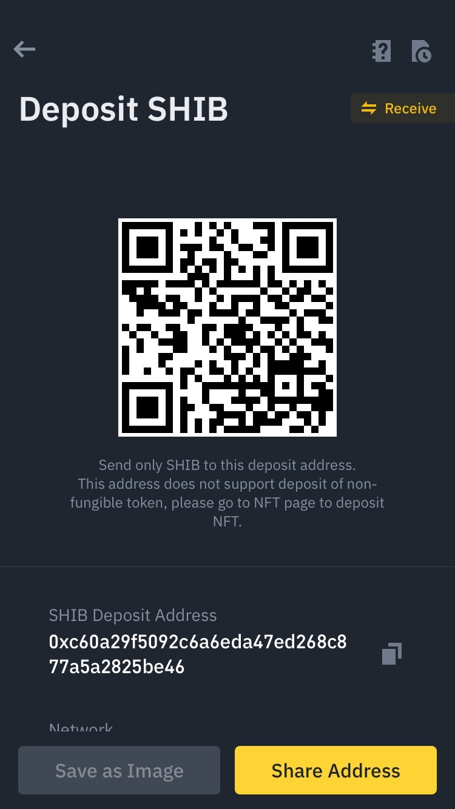
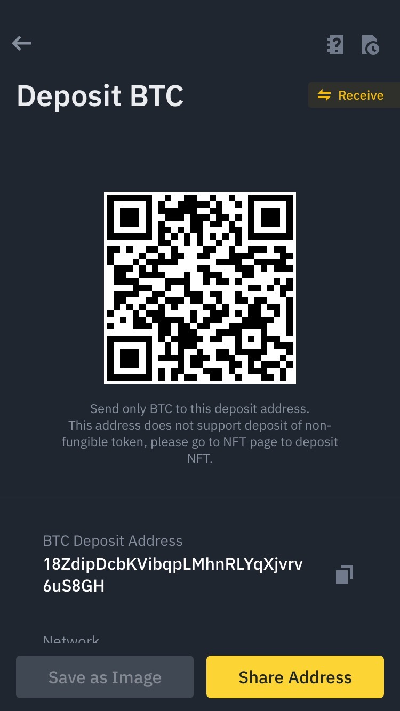

# Search-Room
Search data from Room Database that using MVVM architecture. 

## Libraries
- Dagger
- Livedata
- Room Database
- Lifecycle
- RecyclerView

## Demo Screenshot
| Main Screen      | Search Screen      |
|------------|-------------|
|  |  | 

## Buy me coffee
| Shiba      | BTC      | ETH      | Doge |
|------------|-------------|-------------|-------------|
|  |  |  |  | 
